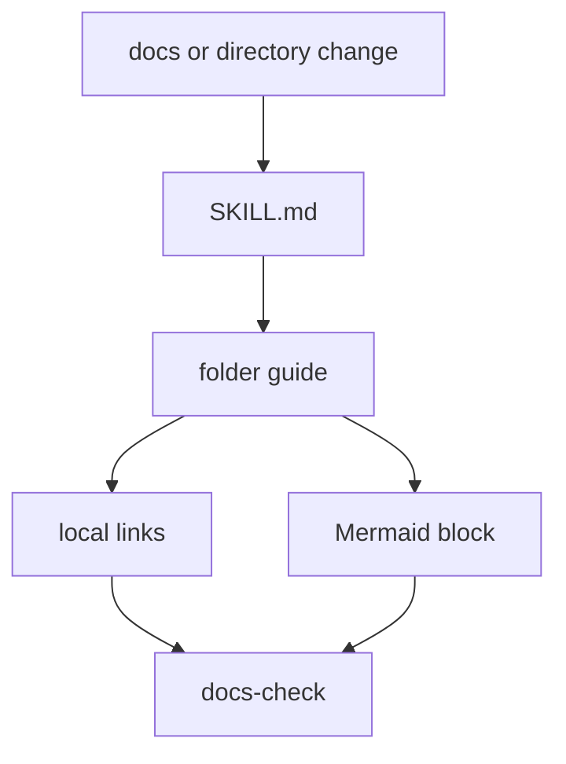

# Docs Guide Maintainer Skill

This skill covers the README-first documentation system and folder guide checks.

Read [SKILL.md](SKILL.md) when adding directories, moving docs, editing guide
files, changing Mermaid blocks, or fixing `scripts/repo/docs-check.sh` failures.

## Files

| Path | What it is for |
| --- | --- |
| `README.md` | this folder guide |
| `SKILL.md` | reusable documentation guide maintenance procedure |
