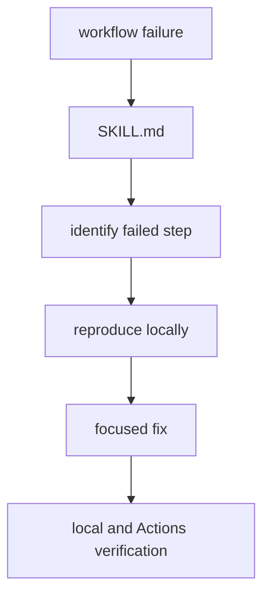

# Helm CI Stabilizer Skill

This skill covers recurring Helm CI failures in this repository.

Read [SKILL.md](SKILL.md) when Helm Lint, Helm Publish, dependency update, GHCR
publish, or the kind smoke workflow fails.

## Files

| Path | What it is for |
| --- | --- |
| `README.md` | this folder guide |
| `SKILL.md` | reusable Helm CI triage and stabilization procedure |
