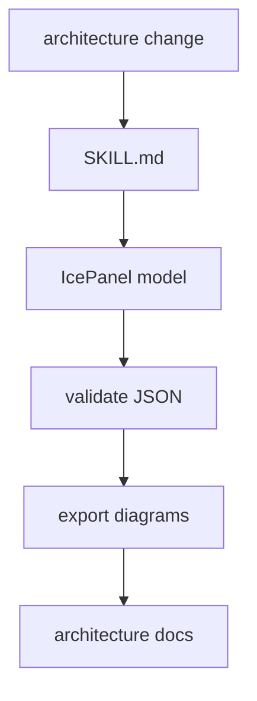

# IcePanel Architecture Maintainer Skill

This skill covers the architecture model and exported diagrams.

Read [SKILL.md](SKILL.md) when changing the IcePanel model, validating
architecture JSON, exporting diagrams, or updating architecture image/PDF
artifacts.

## Files

| Path | What it is for |
| --- | --- |
| `README.md` | this folder guide |
| `SKILL.md` | reusable IcePanel architecture maintenance procedure |
