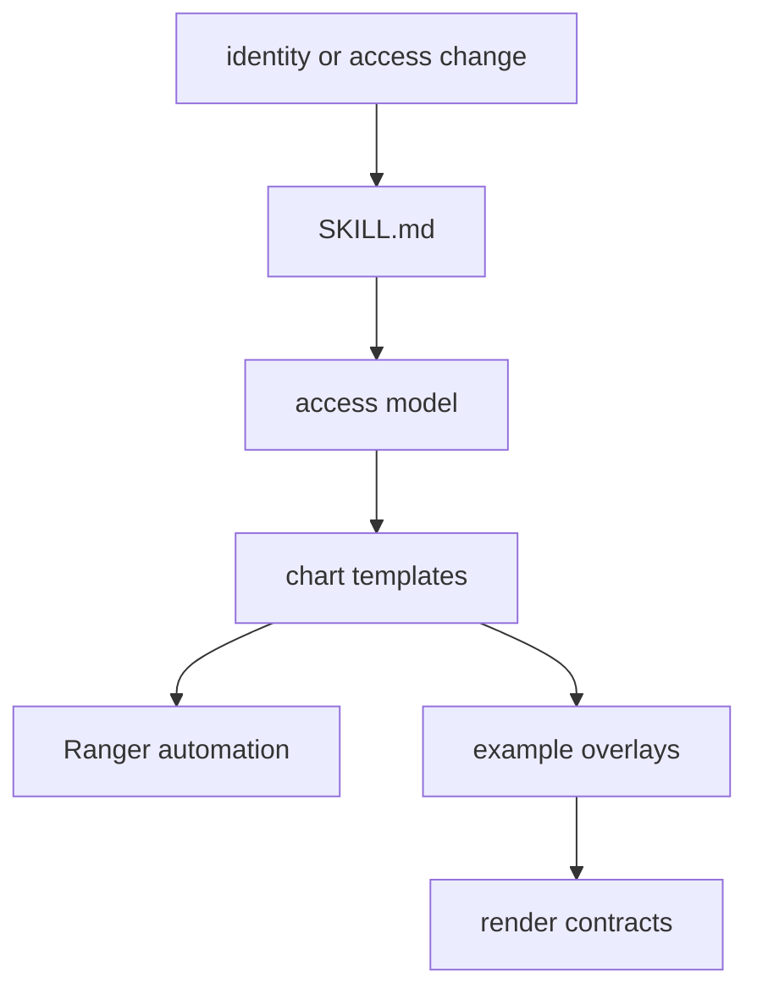

# Identity Access Maintainer Skill

This skill covers the repo's repeated identity, access, and governance changes.

Read [SKILL.md](SKILL.md) when changing Keycloak, Ranger, oauth2-proxy,
platform-home launchers, app access, role models, catalog governance, or
browser SSO behavior.

## Files

| Path | What it is for |
| --- | --- |
| `README.md` | this folder guide |
| `SKILL.md` | reusable identity and access maintenance procedure |
