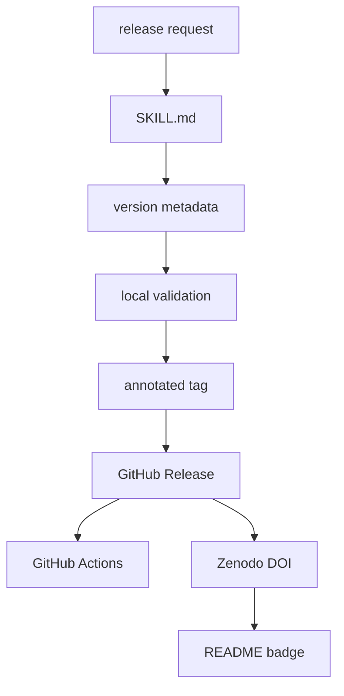

# Release Agent Skill

This folder contains the reusable release skill for this repository.

Read [SKILL.md](SKILL.md) when creating tagged Helm chart releases, GitHub
Releases, GHCR publications, Zenodo DOI metadata, or DOI badges.



## Files

| Path | What it is for |
| --- | --- |
| `README.md` | this folder guide |
| `SKILL.md` | agent-neutral release procedure |

## Validation

After editing this skill, run:

```bash
SKIP_MERMAID_CHECK=1 ./hack/docs-check.sh
```
