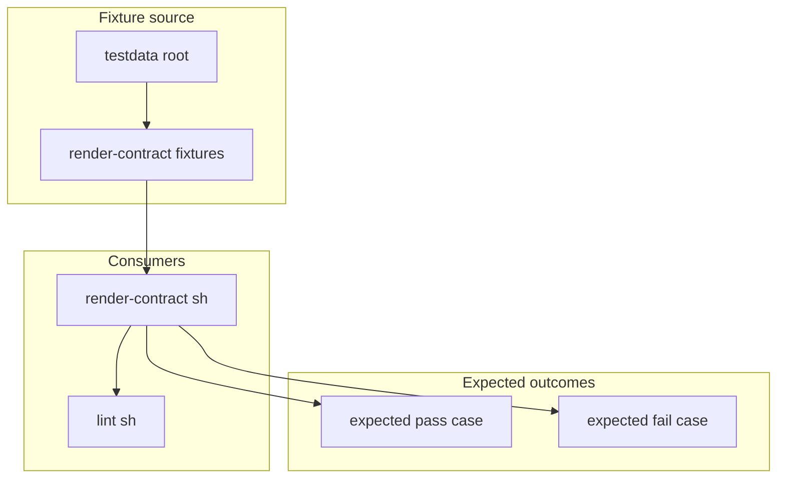

# Chart Test Suite
This folder contains tests for the Helm chart, designed to isolate and test
one rule or render contract at a time.

## Who Should Read This

| Reader | Why this guide matters |
| --- | --- |
| contributor | to know where to add tiny focused fixtures instead of bloating the real example overlays |
| maintainer | to understand how script-level contract tests are fed |



## What Lives In This Folder

| Path | What it is for                                                                                       |
| --- |------------------------------------------------------------------------------------------------------|
| `render-contract.sh` | Script that performs testing against the provided values file using the overlays in `render-contract` |
| `render-contract/` | YAML overlays used by `render-contract.sh`                                                       |
| `README.md` | Guide file for this folder                                                                           |

## Test Script Behaviour

What `render-contract.sh` does:

- renders the chart against known-good baselines
- merges small one-purpose fixture files from `test/render-contract/`
- checks that expected strings appear or do not appear
- checks that invalid inputs fail with the right messages

Why it matters:

- many of the chart's guarantees are about rejecting bad configuration
- this script is the concrete proof that those rejections still happen

Use the script when:

- changing validation logic
- changing auth and governance behavior
- changing what the example overlays are expected to render

## Fixture Philosophy

Test fixtures are designed around one rule:

- one small input
- one focused behavior
- one easy-to-understand expected outcome

The repo already has full example overlays under
`examples/`. The fixtures here exist so validation logic can be tested without
turning every edge case into a giant environment file.

## How This Folder Fits Into Validation

`render-contract.sh` takes:

- a known-good baseline example from `examples/`
- one focused overlay from this folder

It then checks either:

- that the render succeeds and contains the expected strings
- or that the render fails with the expected message

`scripts/verify.sh` includes that render-contract script, so these fixtures are part
of the normal repo validation path.

## Common Tasks

If you need to:

- add a new validation regression case: add a tiny fixture under
  `render-contract/`
- test a new allowed configuration: add a focused expected-pass overlay
- test a new forbidden configuration: add a focused expected-fail overlay

## Validation

After changing files in this folder, run:

```bash
./render-contract.sh
```

## Common Mistakes

- copying a whole example values file into this folder
- testing several unrelated rules in one fixture
- adding a fixture file but forgetting to wire it into `render-contract.sh`

## When You Can Ignore This Folder

You can ignore this folder unless you are changing script-driven validation or
adding a regression test.
