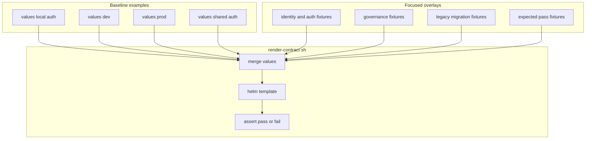

# Render-Check Test Files

This folder contains the focused YAML overlays used by `../../../ test/render-contract.sh`.

Each file is intentionally small. The script merges one of these overlays onto
top of a known-good baseline example from `../../examples`, then checks whether the
render should pass or fail.

## Who Should Read This

| Reader | Why this guide matters |
| --- | --- |
| contributor | to know how to add a new contract test without creating a new full example environment |
| maintainer | to map fixtures back to the validation logic they are exercising |



## How The Script Uses This Folder

`../../../ test/render-contract.sh` currently uses baseline examples from:

- `../../examples/values-local-auth.yaml`
- `../../examples/values-dev.yaml`
- `../../examples/values-prod.yaml`
- `../../examples/values-shared-auth.yaml`

The fixtures in this folder are never meant to stand alone. They are overlays.

That means a newcomer should read any fixture file as:

"What tiny change are we applying to a known-good baseline to prove one rule?"

## Fixture Inventory

### Positive overlays

These fixtures are expected to render successfully and prove supported paths:

| File | What it proves |
| --- | --- |
| `prefect-automation-enabled.yaml` | machine access for Prefect can be enabled when the required proxy and client wiring exist |
| `prefect-direct-grant-enabled.yaml` | developer direct-grant access for Prefect can be enabled when the required client wiring exists |

### Governance and authorization failures

These fixtures exercise the governance validation template:

| File | What it targets |
| --- | --- |
| `missing-governance.yaml` | catalog governance block missing in `dev` or `prod` |
| `missing-fine-grained-policy.yaml` | restricted catalog missing column allowlist, masking, or row-filter policy coverage |
| `invalid-platform-role-app.yaml` | deprecated `global.authorization.platformRoles` is rejected |
| `invalid-access-model-app.yaml` | unsupported app access key in the identity access model |
| `access-model-group-role-mappings.yaml` | deprecated access-model group-to-role mappings |
| `access-model-ranger-override.yaml` | deprecated Ranger mapping nested under an identity access-model role |
| `oauth2-proxy-allowed-groups.yaml` | deprecated oauth2-proxy `allowedGroups` client setting is rejected |
| `platform-home-required-groups.yaml` | deprecated Platform Home launcher `requiredGroups` setting is rejected |
| `catalog-authorized-groups.yaml` | deprecated catalog `authorizedGroups` ACL setting is rejected |
| `ranger-membership-source.yaml` | deprecated Ranger-owned platform role membership source is rejected |
| `exception-missing-metadata.yaml` | platform role exception missing required approval metadata |

### Identity and environment failures

These fixtures target the shared identity contract and environment checks:

| File | What it targets |
| --- | --- |
| `missing-environment.yaml` | shared catalog governance without a valid `global.environment` |
| `missing-identity-environment.yaml` | shared identity without a valid `global.environment` |
| `missing-config-cli-secret.yaml` | bundled Keycloak without the required config CLI secret |
| `missing-directory-url.yaml` | LDAP-backed shared identity without a directory URL |
| `platform-home-missing-redirect.yaml` | bundled Keycloak-managed `platformHome` client missing redirect URIs |
| `wildcard-redirect.yaml` | wildcard redirect URIs outside local environments |
| `legacy-top-level-identity.yaml` | deprecated top-level `identity` block |
| `legacy-trino-authentication-type.yaml` | deprecated Trino password-auth configuration path |

### Prefect and CloudBeaver auth failures

These fixtures test app-client wiring around oauth2-proxy and bearer-token
configuration:

| File | What it targets |
| --- | --- |
| `prefect-automation-missing-client-id.yaml` | Prefect automation client missing required client ID |
| `prefect-automation-authproxy-disabled.yaml` | Prefect automation enabled while Prefect auth proxy is disabled |
| `prefect-automation-prefectproxy-disabled.yaml` | Prefect automation enabled while the shared Prefect browser client is disabled |
| `prefect-direct-grant-missing-client-id.yaml` | Prefect direct-grant client missing required client ID |
| `prefect-direct-grant-authproxy-disabled.yaml` | Prefect direct-grant enabled while Prefect auth proxy is disabled |
| `prefect-direct-grant-prefectproxy-disabled.yaml` | Prefect direct-grant enabled while the shared Prefect browser client is disabled |
| `prefect-token-audience-mismatch.yaml` | Prefect machine and developer bearer-token clients disagree on token audience |
| `cloudbeaver-missing-secret.yaml` | CloudBeaver auth-proxy config secret missing |

### `keycloakLocal` edge cases

These fixtures target the local auth-heavy modes:

| File | What it targets |
| --- | --- |
| `keycloak-local-registration-disabled.yaml` | `keycloakLocal` mode without self-registration enabled |
| `keycloak-local-trino-password-auth-enabled.yaml` | `keycloakLocal` mode trying to use LDAP-style Trino password auth |
| `keycloak-local-usersync-enabled.yaml` | `keycloakLocal` mode with Ranger LDAP usersync still enabled |
| `keycloak-local-ldap-enabled.yaml` | `keycloakLocal` mode with LDAP directory mode still enabled |
| `keycloak-local-email-verification-disabled.yaml` | focused edge-case fixture for local Keycloak registration behavior; if it is not referenced in `../../../ test/render-contract.sh`, it is inert until explicitly added |

## How To Add A New Fixture

Keep the pattern consistent:

1. choose the smallest baseline example that already has most required settings
2. add only the keys needed to prove the new rule
3. give the file a name that says what should fail or pass
4. wire the file into `../../../ test/render-contract.sh`
5. assert on a specific success marker or failure message

## What Not To Do

Do not use this folder for:

- full install profiles
- secrets copied from real environments
- fixtures that test several unrelated behaviors at once
- documentation examples meant for users

That work belongs under `../../examples`, not here.

## Validation

After changing any fixture in this folder, run:

```bash
./hack/render-contract.sh
./hack/lint.sh
```

## Common Mistakes

- adding a fixture file without adding the corresponding assertion in
  `../../../ test/render-contract.sh`
- putting too much content in one file so the failure reason becomes unclear
- reusing a baseline that hides the specific rule you were trying to test

## When You Can Ignore This Folder

You can ignore this folder unless you are changing validation behavior or
adding a regression fixture.
